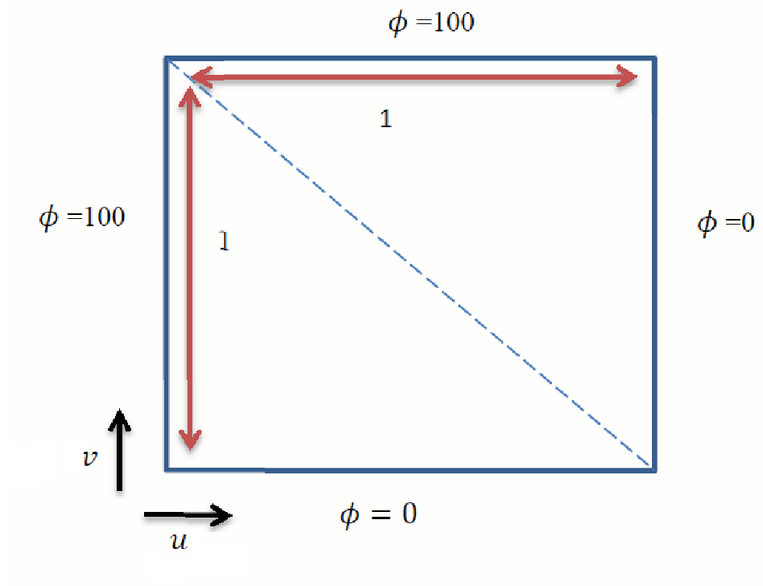
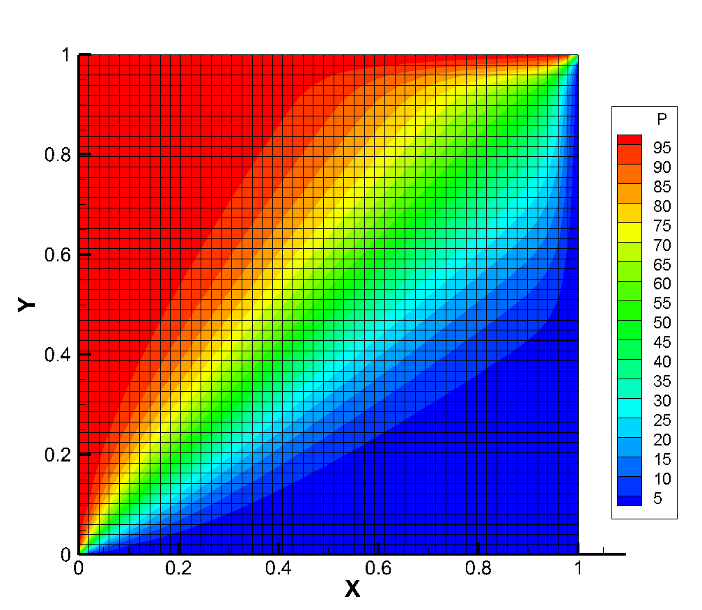

## ConvectionDiffusion
This FORTRAN code is developed to solve convection-diffusion equations in a 2D geometry (see Fig.1). \
\
 
Fig.1. Schematic illustration of the geometry.
\
The task is to build a convection and diffusion couples solver. Thus the main goal here is to solve the convection-diffusion equation for a passive scalar φ as:\
\
\
\
Considering the velocity field is known, the above transport equation predicts the motion of a scalar (such as temperature) due to three mechanisms: (1) convection, (2) diffusion and (3) any added source terms. \
This modular code was developed using (i) Central Difference, (ii) Upwind, and (iii) Quick schemes for a given velocity field _u(x; y) = (u(x; y); v(x; y))_.\

The contour calculated for ρ=100, u=v=2, and Г=5.0 on a 50x50 grid is shown below. \

 

**Developed by Faraz Arbabi, Ph.D.®\
University of Toronto**
